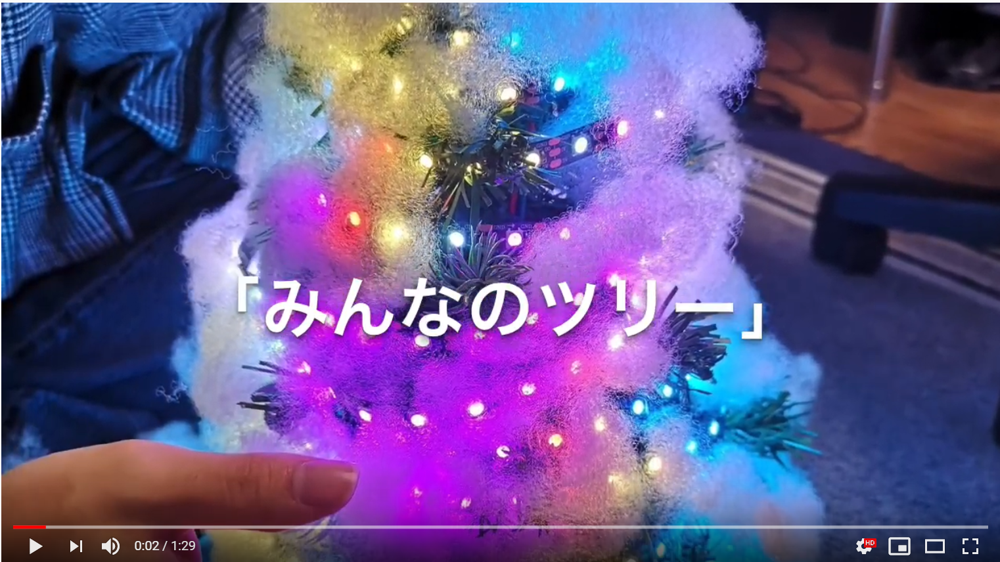

# みんなのツリー

## 製品概要

### 北広島 × Tech

### 背景（製品開発のきっかけ、課題等）

北海道には北広島駅というJRの駅があり、冬になると駅構内にクリスマスツリーが飾られます。  
とても大きくて電飾もきれいなのですが、どうも人の集まりがいまいちな気がして、もったいないような気がしてなりませんでした。  
そこでこのツリー、さらには北広島を盛り上げていければと思い、この「みんなのツリー」を作ることにしました。  
 

### 製品説明（具体的な製品の説明）
  
「みんなのツリー」  
 
このツリーは誰でもイルミネーションをデザインすることができ、実際のツリーに反映させることができます。  
投稿されたものは、1つのデザインにつき一定の時間表示されます。届いたデザインから順番に表示されていきますが、新しいデザインがなくなると、過去に投稿されたデザインからランダムに表示させます。  
 
デザインの方法は簡単で直感的です。webアプリなので操作はブラウザから。  
タッチ対応なのでスマホからは色を選んでなぞるだけでOK。  
デザインが出来上がったら、その名前とどのようなデザインか？を選択し、送信ボタンを押します。  
"送信したデザインはすぐに光ってくれるの？"---光り待ちのデザインがあれば、順番に表示されていきます。待ち時間は送信した際のページで表示されるので、大体の時間もわかります。光り待ちのデザインがなかったときは、ラッキー！すぐに表示されます。  
 
光り方は、ツリーが横に3分割してあって、その一つ(三角形)をデザインする形になります。  
1つ目の面が最初に光り、それが2つ目、3つ目の面に移っていきます。
新たなデザインは一定の間隔で1つ目の面に光ります。  
1つのデザインで3回の面を見て楽しむことができます。

### 特長

#### 1. ユーザー参加型イルミネーション！  

#### 2. きらきら光ってインスタ映え！！  

#### 3. フルカラー対応

### 解決出来ること

このツリーを見にたくさんの人が訪れ、観光産業を盛り上げることができます！

### 今後の展望

・光らせる際にフェードイン、アウトする  
・文字をいくつか連続させて表示(パラパラ漫画のように)させる機能をつける  
・リアルタイムでデザインがツリーと連動する機能(socket通信?)  

## 開発内容・開発技術

### 活用した技術

・全体的にオーソドックスな技術を様々組み合わせて使いました。  
・家にweb/appサーバーを立てて利用しました。(CentOS)  

#### API・データ

今回は提供されたものを使用することはありませんでした。

#### フレームワーク・ライブラリ・モジュール

* Django(web framework, Python)
* FastLED(library, ArduinoIDE)
* Bootstrap(css, jsなど)

#### デバイス

* ESP32 (esp-wroom-32搭載)
* WS2812B(LEDストリップ,300LEDs)  
(* 5V6A 直流電源)  

### 独自開発技術（Hack Dayで開発したもの）

#### 2日間に開発した独自の機能・技術

・ ブラウザ→サーバ→ESPにデータを遷移させること！
・JavaScriptによるcanvasの正確な制御、色の読み取り
